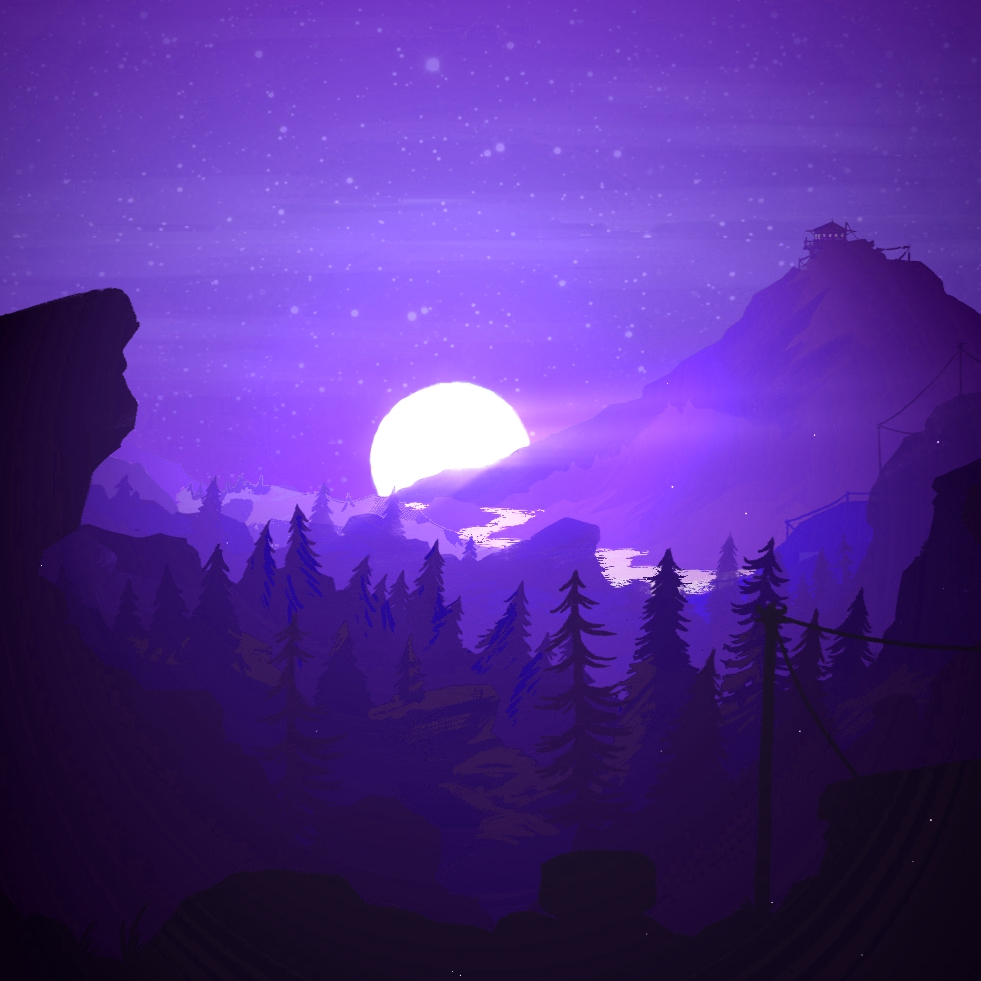
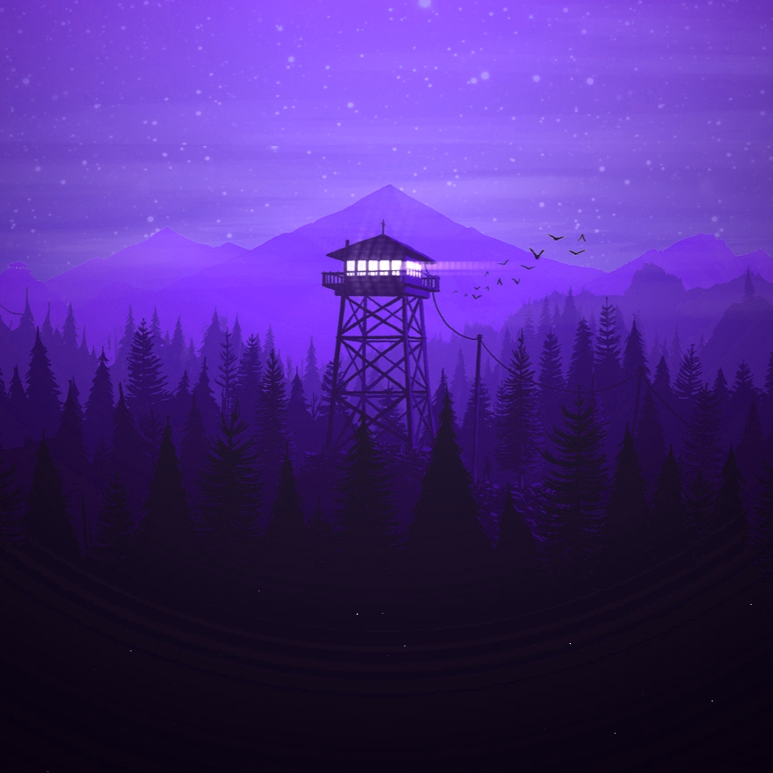

# Installation
## Windows
1. Open your Steam library, and find Wallpaper Engine
2. Right-click on Wallpaper Engine > Manage > Browse local files
3. Open the `projects` folder, and run the command:

```
git clone https://github.com/Dio-Lopes/Wallpaper-Engine-Projects.git myprojects
```
In the app, the projects should automatically appear in the Wallpaper Editor.

# Projects

Here I list all the projects in the repository so far.

- [2 Part Night Sky (Moon)](https://steamcommunity.com/sharedfiles/filedetails/?id=3586894862)

- [2 Part Night Sky (Watchtower)](https://steamcommunity.com/sharedfiles/filedetails/?id=3586902297)


# Acknowledgements
- This wouldn't be possible without the [repack tool](https://github.com/redpfire/we) from redpfire.
